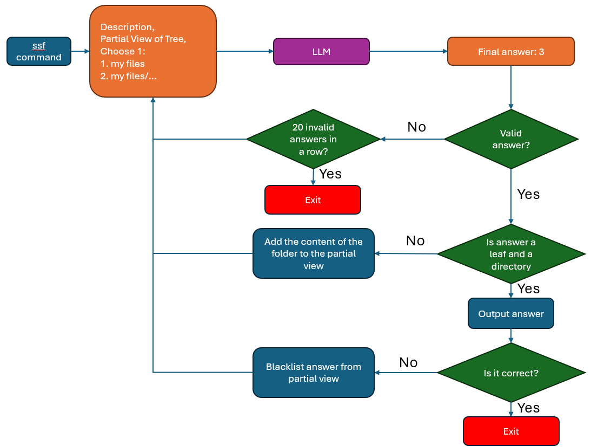

# App Workflow

## Rationale of Design Decisions
The model prompt uses a numbered list for the partial view and is trained to output just the number to reduce the number of invalid responses; so long it is a number within the range, it can be explored, in contrast to outputting the entire path where a single wrong character makes it invalid. In addition, by controlling what options the model could output, blacklisted files/folders can be ommitted from the list of allowable outputs.

The model does not differentiate between selecting vs. exploring because it was found that this would become another point of failure.

**mistral:latest / unsloth/mistral-7b-instruct-v0.3-bnb-4bit** was selected for the main model out of the following:
- dolphin3 model did not have unsloth.
- llama3.1 8b was just too big and the small models were unusable.
- deepseek-r1 was too slow in ollama and the smaller had lower performance.

## Data
Synthetic data generation was used generate the training data samples since there was no premade dataset. The process was as follows:
1. Various personas were created using the Faker library. 
2. These were fed into the dolphin3 ollama model to create a variety of file systems. 
3. These were then cleaned and multiple partial views were obtained from each.
4. Next, a random desired file/folder in the file system was selected per partial view. A description of desired file/folder was generated with dolphin3 and the correct output (number corresponding to desired file/folder or the deepest available folder) was determined.
5. This information was packaged into the model prompt and answer format.

## Finetuning Model
**unsloth/mistral-7b-instruct-v0.3-bnb-4bit** was finetuned with using QLORA. Wandb was used to keep track and visualize of training information. 

## Limitations and Future Work

Data could be augmented with github project folder structures.

Training was limited to RTX4060 capabilities (8Gb VRAM). 

Training hyperparameters were barely explored.

Chatting capabilities (remembering previous inputs) was not taken advantage because it is not necessary and making the training data could take more effort. However, it may also allow intermediate user feedback to more efficiently find the desired file/folder.  

